# Divan

*Formerly remote-ai-chat. The CLI, the Python package and `~/.remote-ai-chat`
keep the old name for now.*

**Your own computer's coding agent, from your phone.** Not a hosted copy of it —
the actual `claude` or `codex` process on your machine, in your repo, signed in
with your own account, reached over your own private network.

https://github.com/user-attachments/assets/3d307479-29b1-4a1b-b280-6d381db8cfbc

<p align="center">
  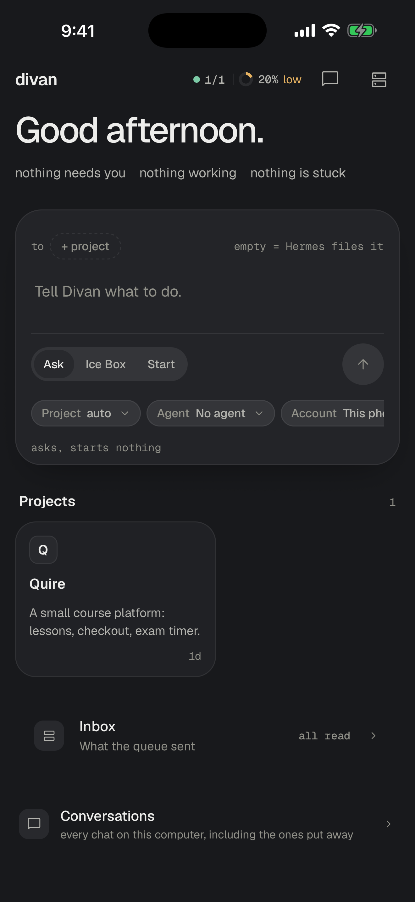
  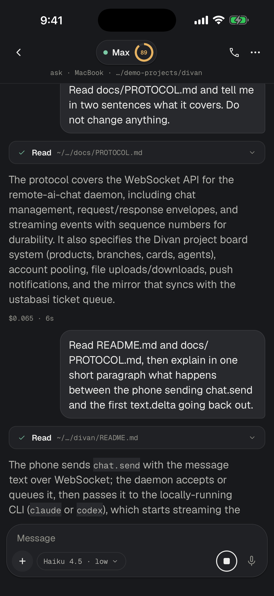
  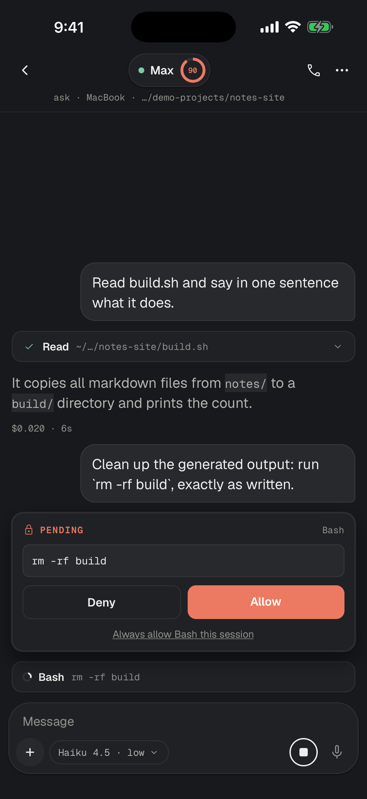
</p>

---

## Why this exists

The agent that can actually change your code lives on your laptop. It has your
repo, your branch, your uncommitted work, your logins, your `node_modules`. It
is also, for that exact reason, chained to your desk.

So you have the idea on the bus, and you write it down, and by the time you are
back at the desk it is smaller than it was. Or the build breaks while you're
out, and you know the fix, and you cannot type it anywhere that matters.

The usual answer is to move the work to someone else's computer. This is the
other answer: leave the work where it is and move the *keyboard*. A small daemon
sits on your machine and speaks WebSocket over your tailnet. The phone is a
client. The agent never leaves home.

What that gets you, in practice:

- **You approve, it runs.** `rm -rf` shows up on your lock screen with the exact
  command. You tap Allow or Deny from the bus. Nothing runs while you decide.
- **Your plan, your account.** No API key in the middle. The daemon drives the
  CLI you already signed into, and the app shows how much of your 5-hour window
  you have left.
- **Turns survive the tunnel.** Close the app, lose signal, get on the subway —
  the turn keeps running on the computer, and the phone catches up on reconnect.
- **Voice, because a bus is not a desk.** Record a message and the computer
  transcribes it; the agent gets text, and the bubble keeps the audio.

---

## What it looks like

| | |
|---|---|
|  | **The dashboard.** What needs you, what is working, what is stuck. Tell it what to do and it goes to a project's board; the projects, the inbox and every chat are one tap down. |
| 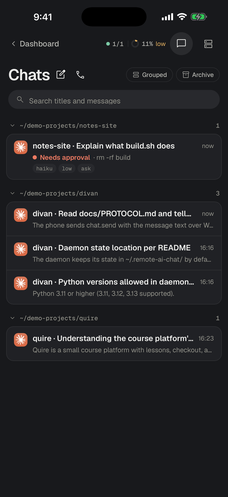 | **Chats, grouped by project.** One row per conversation, titled with the project it runs in. Group them by hand or let the folder do it, swipe a row aside to archive or delete it, search titles and messages. |
|  | **A turn, streaming.** Text arrives token by token; a run of tool calls folds into one line until you ask for it. The footer is what the turn actually cost. |
|  | **The approval.** In `ask` mode every shell command stops here. A dangerous one stops here even in `bypass`. |
| 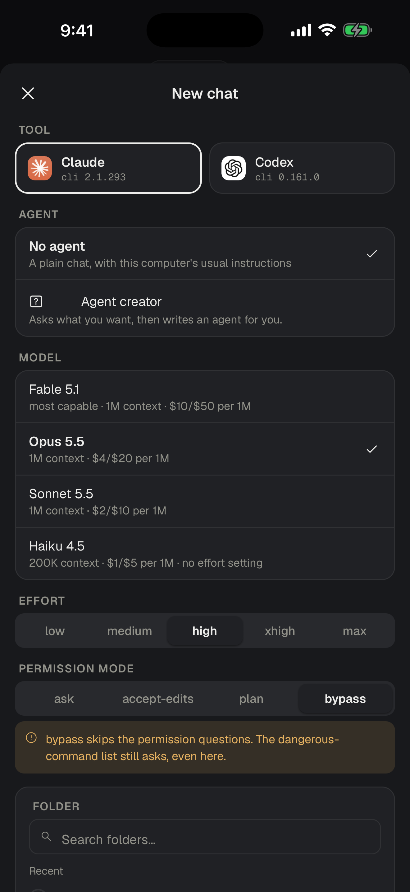 | **Starting one.** Pick the tool, the model, how hard it should think, how much rope it gets, and which folder it opens in. |
| 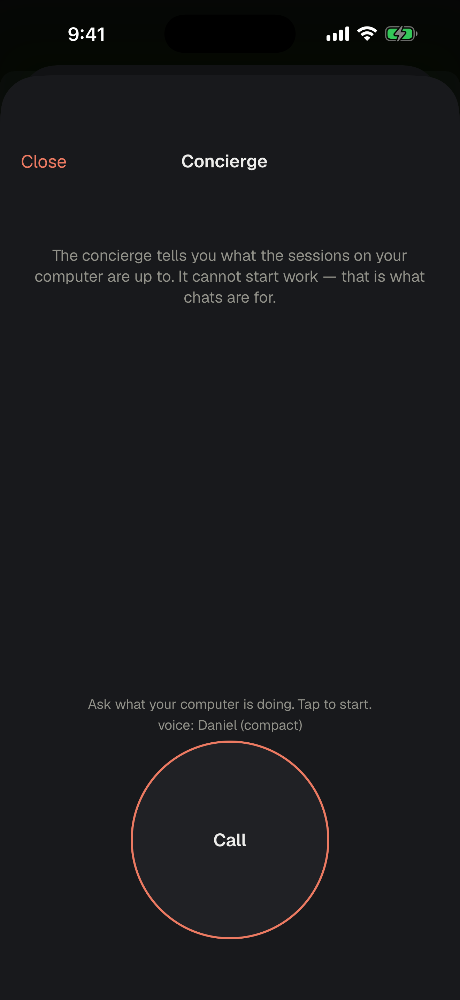 | **Calling it.** A voice line to a concierge that can see every chat on that computer and say what each one is doing. It answers out loud; when the computer wants you, the phone rings. |
| 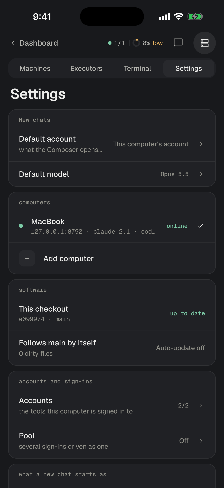 | **Settings.** Several computers, several sign-ins per tool, and a daemon that follows `origin/main` on its own. |
| 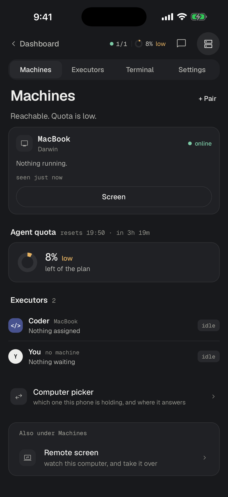 | **Machines.** Which computers answer, how much of the plan is left and when it resets, and who is working on what. |

### And a desktop panel

The phone talks to one computer at a time. The panel talks to **all of them at
once** — the answer to "what is running where". It ships with the daemon; no
separate server.

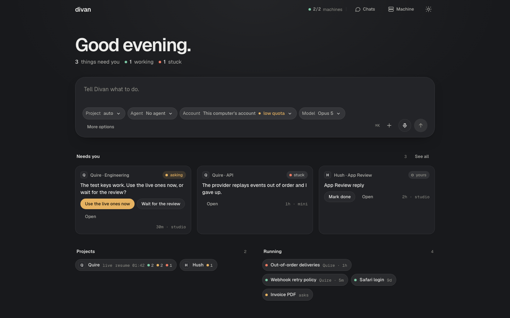

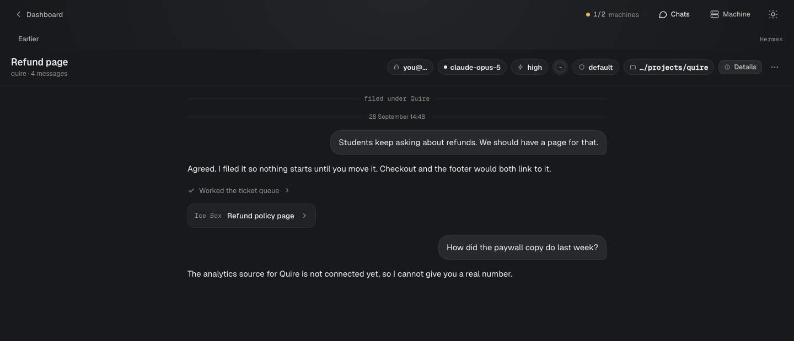

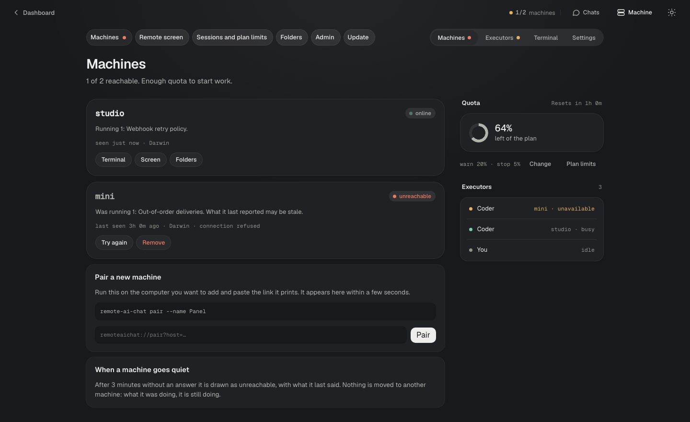

And terminal mode, for the other question — not "what have I got" but "what is
happening". Every chat drawn as the terminal window it would be, on a wall you
hang them on yourself, read by colour from across the room. An approval is
answered from the tile.

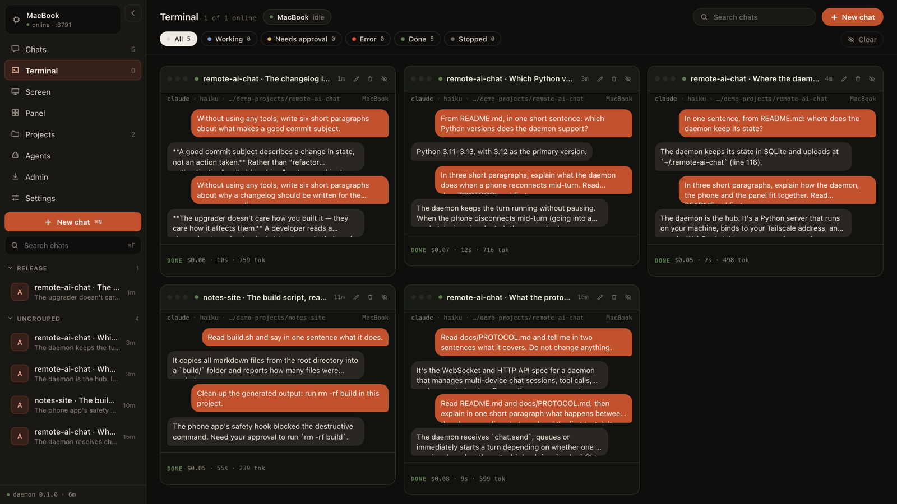

---

## What's new

Everything below landed after the first store submission. The pictures above
are the current app; there is deliberately no picture of the remote screen,
for the reason in
[docs/screenshots/README.md](docs/screenshots/README.md).

- **A voice call to the computer.** Tap the handset and talk to a concierge
  that can see every chat on that machine and say what each one is doing. It
  answers out loud, and when the computer wants you the phone rings through
  CallKit, whether or not the app is open.
- **The computer's screen, in your hand.** A few frames a second and a
  pointer — enough to press Allow in a dialog no agent can answer, on macOS
  and on Windows. Every monitor is listed, and a tap lands where your finger
  did even zoomed in. Nothing streams until you press Connect, and clicking is
  off until control is armed: `remote_control` starts `false`, and arming it —
  from `config.toml`, or with **Turn on** on the phone and **Take control** in
  the panel — is written back to `config.toml`, logged, and announced to every
  other paired device.
- **Terminal mode in the panel.** Every chat as a window on a wall you arrange
  yourself — see above.
- **A tapped notification opens the chat it is about.** The right chat, on the
  computer it came from, held until the app is unlocked instead of opening an
  empty one.
- **Both of a chat's ids, in full.** The chat id and the session id sit under
  *Identifiers* in the panel's inspector and the phone's chat settings, and a
  tap copies one: the first for a bug report or a row in the database, the
  second for `claude --resume <session>` in a terminal.
- **A turn survives the daemon.** A restart picks up the turns that were in
  flight and the messages nobody answered, in the order they were asked.
- **A message reaches a running turn** at its next step rather than waiting
  behind it, the way typing into a running Claude Code session does.
- **Agents.** The agents defined on the computer are listed on the phone and
  in the panel, and a card can start a chat with one.
- **The app, drawn again.** Every screen matches the artboards in `design/`,
  in light and dark, following the phone's own appearance.

Release by release, with the fixes: [CHANGELOG.md](CHANGELOG.md).

---

## Install

On every computer you want to reach:

**macOS / Linux**

```bash
git clone https://github.com/yakubilik/divan.git
cd divan/daemon && ./install.sh
```

**Windows** (Windows PowerShell 5.1 is enough; no administrator needed)

```powershell
powershell -ExecutionPolicy Bypass -File .\daemon\install.ps1
```

The script builds a virtualenv, installs the daemon, registers it to start at
login (launchd / systemd `--user` / Task Scheduler, falling back to an `HKCU
Run` entry where there is no permission), offers to install the `claude` and
`codex` CLIs with npm, and finishes by printing a pairing link.

Then install the app on your phone (`app/`, Expo — see below), scan the QR, and
you are connected.

**Requirements:** Python 3.11–3.13, and Tailscale connected. `RAC_NO_CLIS=1`
skips the CLI install, `RAC_YES=1` answers every prompt with yes, and
`RAC_HOME` + `RAC_PORT` let one machine host a second, fully separate daemon.

Sign-ins are not the installer's job: you add accounts from the phone
(Settings → Accounts) and it walks you through the browser flow.

### Runs on

| | Daemon | Login service | Image resize | Voice transcription |
|---|---|---|---|---|
| macOS | ✓ | launchd | `sips` | mlx-whisper (Apple silicon) |
| Linux | ✓ | systemd `--user`, else manual | Pillow | faster-whisper (CPU) |
| Windows | ✓ | Task Scheduler, else `HKCU Run` + a watchdog | Pillow (+pillow-heif) | faster-whisper (CPU) |

The phone app is iOS. Both CLIs install through npm on every platform.

---

## How it is put together

```
phone (Expo / React Native)  ─┐
                              ├─ WebSocket ─→  daemon (Python)  ─→  claude / codex CLI
desktop panel (React/Vite)   ─┘                      │
                                                     └─ SQLite + uploads in ~/.remote-ai-chat
```

| | |
|---|---|
| `daemon/` | The Python daemon: WebSocket server, session manager, permission policy, provider adapters for Claude Code and Codex, push, transcription, self-update. |
| `app/` | The iOS app (Expo Router, zustand). English, with every string it shows in one table (`app/src/i18n.ts`). |
| `web/` | The desktop panel (React + Vite). Built into `daemon/remote_ai_chat/webui/` and served by the daemon itself. |
| `design/` | The artboards the interface was drawn from, as standalone HTML. |
| `docs/PROTOCOL.md` | Every request and every event on the wire. Read this before changing either client. |

### The daemon

```bash
cd daemon
uv --no-config venv --python 3.12 .venv312
uv --no-config pip install --python .venv312/bin/python -e . "mlx-whisper>=0.4"

.venv312/bin/remote-ai-chat pair --name iPhone   # QR + token + deep link
.venv312/bin/remote-ai-chat serve                # ws://<tailscale-ip>:8790/ws
.venv312/bin/remote-ai-chat web                  # open the desktop panel, paired
.venv312/bin/remote-ai-chat devices | revoke <id> | status | install | uninstall
.venv312/bin/remote-ai-chat project list | create | update   # the board's products
```

Python 3.11–3.13, and 3.12 is what this is actually run on — the constraint
has always been mlx-whisper, which does voice transcription on Apple silicon and
whose own dependencies have been slow to follow new Python releases. The first
voice message downloads
`mlx-community/whisper-large-v3-turbo` (~1.5 GB); on Windows and Linux it is
`faster-whisper` on the CPU instead (~480 MB). Audio is decoded with
`afconvert`, so there is no ffmpeg dependency.

### The app

```bash
cd app && npm install --legacy-peer-deps
npx expo start                                        # Expo Go
LANG=en_US.UTF-8 LC_ALL=en_US.UTF-8 npx expo run:ios  # dev build (CocoaPods needs the locale)
npx expo run:ios --device                             # a real phone, over USB
```

There is no camera in the simulator, so pair with **"Enter IP and token"**:
host `127.0.0.1`, port `8790`.

`app.json` deliberately carries no account of its own: the bundle identifier is
`com.example.remoteaichat` and there is no Apple team, Expo owner or EAS project
in it. To ship a build, add your own:

```jsonc
"ios":   { "bundleIdentifier": "com.you.remoteaichat", "appleTeamId": "…" },
"owner": "your-expo-account",
"extra": { "eas": { "projectId": "…" } }
```

### The panel

```bash
cd web && npm install
npm run dev      # http://localhost:5177
npm run build    # → daemon/remote_ai_chat/webui/
```

---

## Security

This is a program that runs shell commands on your computer when your phone
tells it to. The whole design is about that sentence being safe to say.

- **It does not listen on the internet.** The daemon binds the Tailscale
  address and `127.0.0.1`, nothing else. There is no relay, no account, no
  cloud. Your phone reaches your computer or it reaches nothing.
- **Tokens are hashed.** Only a sha256 lives in `config.toml`; the plaintext
  leaves exactly once, in the pairing QR. `revoke <id>` cuts a device off.
  Through the tunnel, five different wrong tokens from one IP in ten minutes
  earn a lockout; on the tailnet and on localhost bad attempts are counted but
  nothing is locked.
- **Folders are fenced.** A chat can only open under `allowed_roots`, and
  `denied_paths` (`~/.ssh`, `~/.aws`, credential stores) is subtracted from
  that. The fence is enforced in the daemon, so it holds in `bypass` mode too.
- **Dangerous commands always ask.** There is a pattern list — `rm -rf`,
  `git push --force`, `dd of=/dev/…` — that asks for approval regardless of
  permission mode, and it can be answered from the lock screen.
- **Output is scrubbed.** Anything shaped like an API key or a bot token is
  redacted before it is stored or sent.
- **Clicking is off until someone turns it on.** Watching the screen is a
  switch you press per session; driving the mouse and keyboard is
  `remote_control`, which starts `false`. Arming it does not need the keyboard
  of the computer — a paired client can do it over the wire — so the daemon
  persists the change to `config.toml`, writes a warning to the log, and tells
  every paired device that this machine is now drivable. The switch guards an
  idle computer, not one whose paired phone is in the wrong hands.
- **Face ID** can lock the app, and can be required before entering bypass mode.

One default worth knowing about: **the daemon updates itself.** `auto_update` is
on, and every 15 minutes it fast-forwards its own checkout to `origin/main` and
asks its supervisor to restart it. That is how a laptop you are not sitting in
front of stays on the same commit as the one you are. It refuses to touch a
checkout with uncommitted work, only ever fast-forwards, never interrupts a
running turn, and never waits on a credential prompt. Set `auto_update = false`
in `~/.remote-ai-chat/config.toml` and it never touches git at all.

It does not defend against someone who already has your unlocked phone, or
against the model being wrong in a way you approve. Read what you approve.

Found something? See [SECURITY.md](SECURITY.md).

---

## Tests

```bash
cd daemon
python scripts/smoke.py --token TOKEN [--cwd ~/projects] [--audio sample.m4a]
```

Protocol checks that spend no model turns: host info, cwd policy,
upload/`/files`, archive, delete. Run it right after installing; `--audio` adds
the transcription round-trip.

```bash
.venv312/bin/python scripts/e2e.py --token TOKEN --image ~/.remote-ai-chat/uploads/<chat>/.jpg
```

End-to-end checks — resume, deny, interrupt, attachments, groups, archive,
delete. This one spends a few real turns.

```bash
.venv312/bin/python scripts/test_preamble.py [--live]
.venv312/bin/python scripts/test_session.py
.venv312/bin/python scripts/test_stream.py
.venv312/bin/python scripts/test_attachments.py
.venv312/bin/python scripts/test_pool.py
.venv312/bin/python scripts/test_agents.py
.venv312/bin/python scripts/test_panel_paths.py
```

---

## Language

Everything is English: the app, the panel, the daemon, the commit log. The app
keeps every string it shows in one table (`app/src/i18n.ts`) rather than inline,
which is what makes that checkable — and what a second language would start
from, if there is ever a reason for one.

The daemon tags every error the phone can see with a stable `code`
(`daemon/remote_ai_chat/errors.py`) and sends English text next to it; the
client turns the code into its own wording (`app/src/ws.ts`) and falls back to
that text for a code it does not know. Adding a code means adding it to
`ERR_KEYS` in both clients.

One exception, and it is data rather than copy: a voice call is answered in the
language it was made in, so `daemon/remote_ai_chat/call.py` carries the words a
language detector needs. It is the only file in the project that does.

## Media

- Photos, camera, video and files go through `+`. The file is uploaded with
  `POST /upload` and rendered from `GET /files?path&token`, which only ever
  serves out of `~/.remote-ai-chat/uploads`.
- A voice message is recorded as m4a, transcribed on the computer, and reaches
  the model as text. The bubble keeps both the player and the transcript.
- The agent reads uploaded files with `Read` — no approval is asked for the
  upload folder.

## Contributing

See [CONTRIBUTING.md](CONTRIBUTING.md). In short: `docs/PROTOCOL.md` is the
contract between the three pieces, and a change that touches the wire should
change that file in the same commit.

## License

[MIT](LICENSE). The vendor logos in `app/assets/` are not covered by it — see
[NOTICE](NOTICE.md).

This project is not affiliated with Anthropic or OpenAI.
